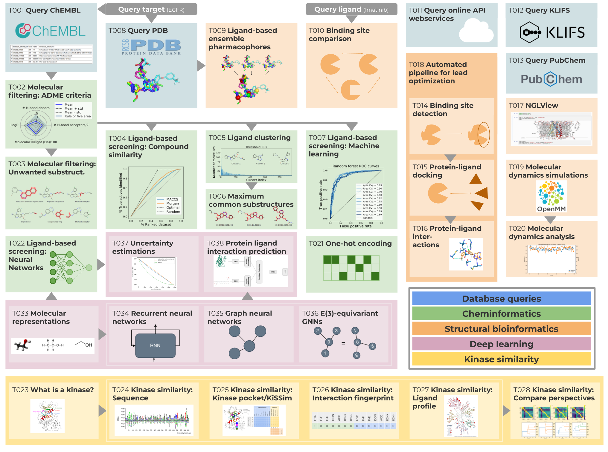

# TeachOpenCADD
A teaching platform for computer-aided drug design (CADD) using open source packages and data.


[](https://doi.org/10.5281/zenodo.1486226)

<!-- markdown-link-check-disable-next-line -->
[](https://mybinder.org/v2/gh/volkamerlab/TeachOpenCADD/master)
[](https://creativecommons.org/licenses/by/4.0/)

[](https://github.com/volkamerlab/teachopencadd/actions?query=branch%3Amaster+workflow%3ACI)
[](https://projects.volkamerlab.org/teachopencadd/)
[](https://anaconda.org/conda-forge/teachopencadd)

Open source programming packages for cheminformatics and structural bioinformatics are powerful tools to build modular, reproducible, and reusable pipelines for computer-aided drug design (CADD). While documentation for such tools is available, only few freely accessible examples teach underlying concepts focused on CADD applications, addressing especially users new to the field.

TeachOpenCADD is a teaching platform developed by students for students, which provides teaching material for central CADD topics. Since we cover both the theoretical as well as practical aspect of these topics, the platform addresses students and researchers with a biological/chemical as well as a computational background.

Each topic is covered in an interactive Jupyter Notebook, using open source packages such as the Python packages `rdkit`, `pypdb`, `biopandas`, `nglview`, and `mdanalysis` (find the full list [here](https://github.com/volkamerlab/teachopencadd#external-resources)). Topics are continuously expanded and open for contributions from the community. Beyond their teaching purpose, the TeachOpenCADD material can serve as starting point for users’ project-directed modifications and extensions.

> If you use TeachOpenCADD in a publication,
> please [cite](https://github.com/volkamerlab/TeachOpenCADD/blob/master/README.md#citation) us!
> If you use TeachOpenCADD in class, please include a link back to our repository.
<!-- markdown-link-check-disable-next-line -->
> In any case, please [star](https://docs.github.com/en/get-started/exploring-projects-on-github/saving-repositories-with-stars)
> (and tell your students to star) those repositories you consider useful for your learning/teaching activities.

<p align="center">
  
  <br>
  <font size="1">
  Figure adapted from Figure 1 in the TeachOpenCADD publication
  <a href="https://jcheminf.biomedcentral.com/articles/10.1186/s13321-019-0351-x">
  (D. Sydow <i>et al.</i>, J. Cheminformatics, 2019)</a>.
  </font>
</p>

## Get started

<!-- markdown-link-check-disable -->
[](https://projects.volkamerlab.org/teachopencadd/)
[](https://mybinder.org/v2/gh/volkamerlab/TeachOpenCADD/master)
<!-- markdown-link-check-enable -->

If you can't wait and just want to read through the materials, please go to the read-only version [here](https://projects.volkamerlab.org/teachopencadd/talktorials.html).

If you'd like to execute the provided notebooks, we offer two possibilities:

<!-- markdown-link-check-disable-next-line -->
- Online thanks to [Binder](https://mybinder.org/). This takes around 10 minutes to get ready, but does not require any kind of setup on your end. Click here to get started: [](https://mybinder.org/v2/gh/volkamerlab/TeachOpenCADD/master). Once it has loaded, you can navigate to `teachopencadd/talktorials/` to find the executable notebooks.
- Locally using our `conda` package. More details in this [section of the documentation](https://projects.volkamerlab.org/teachopencadd/installing.html).

## TeachOpenCADD KNIME workflows

<!-- markdown-link-check-disable-next-line -->
[](https://pubs.acs.org/doi/10.1021/acs.jcim.9b00662)
[](https://doi.org/10.5281/zenodo.3626897)
[](https://hub.knime.com/volkamerlab/spaces/Public/latest/TeachOpenCADD/TeachOpenCADD)

If you prefer to work in the context of a graphical interface, talktorials T001-T008 are also available as [KNIME workflows](https://hub.knime.com/volkamerlab/space/TeachOpenCADD/TeachOpenCADD). Questions regarding this version should be addressed using the "Discussion section" available at [this post](https://forum.knime.com/t/teachopencadd-knime/17174). You might need to create a KNIME account.

## External resources

### Python programming introduction

The TeachOpenCADD platform is not a Python programming course from scratch but teaches how to solve tasks in cheminformatics and structural bioinformatics programmatically.
If you wish to get started first with a Python programming introduction before diving into the TeachOpenCADD material, here are a few great resources to do so:

- [AI in Medicine course](https://github.com/volkamerlab/ai_in_medicine) by the [Volkamer Lab](https://volkamerlab.org/) and [Ritter Lab](https://psychiatrie-psychotherapie.charite.de/metas/person/person/address_detail/ritter-7/) at the Charité: Introduction to Python basics, Jupyter Notebook, and important data science packages such as Pandas, Matplotlib and Scikit-learn
- [Python for Chemists course](https://github.com/GDChCICTeam/python-for-chemists) by the [GDCh/CIC](https://en.gdch.de/network-structures/divisions/computers-in-chemistry-cic.html) team: Crash-course introduction to Python for natural scientists
- [MolSSI Education Resources](http://education.molssi.org/resources.html) by [The Molecular Sciences Software Institute](https://molssi.org/): Collection of tutorials on Python programming basics and data analysis but also more advanced material on software development and computational molecular science
- [Core lessons](https://software-carpentry.org/lessons/) by the [Software Carpentry](https://software-carpentry.org/): Introduction to Python, Git, command line interfaces and more

### Cheminformatics resources

The following resources are collections of interesting cheminformatics-related training material, blogs, and books.

- [Curated list of resources from the RDKit UGM 2020](https://github.com/rdkit/UGM_2020/blob/master/info/curated_list_of_resources.md)
- [A Highly Opinionated List of Open Source Cheminformatics Resources](https://github.com/PatWalters/resources/blob/main/cheminformatics_resources.md) by Pat Walters
- [Awesome Cheminformatics](https://github.com/hsiaoyi0504/awesome-cheminformatics#resources) by Yi Hsiao

### Structural bioinformatics resources

- [Education & Tutorials of the Bonvin Lab](https://www.bonvinlab.org/education/molmod_online/)

## Contact

   

Please contact us if you have questions or suggestions!

- If you have questions regarding our Jupyter Notebooks, please [open an issue](https://github.com/volkamerlab/teachopencadd/issues) on our GitHub repository.
- If you have ideas for new topics, please fill out our questionnaire: [contribute.volkamerlab.org](http://contribute.volkamerlab.org)
- For all other requests, please send us an email: teachopencadd@charite.de

We are looking forward to hearing from you!

## License

This work is licensed under the Attribution 4.0 International (CC BY 4.0).
To view a copy of this license, visit http://creativecommons.org/licenses/by/4.0/.

## Citation

If you make use of the TeachOpenCADD material in scientific publications, please cite our respective articles. It will help measure the impact of the TeachOpenCADD platform and future funding, thank you!

### TeachOpenCADD Jupyter notebooks

TeachOpenCADD Jupyter notebooks' main citation: Talktorials T001-T022 ([paper](https://academic.oup.com/nar/advance-article/doi/10.1093/nar/gkac267/6582172))

```
@article{TeachOpenCADD2022,
    author = {Sydow, Dominique and Rodríguez-Guerra, Jaime and Kimber, Talia B and Schaller, David and Taylor, Corey J and Chen, Yonghui and Leja, Mareike and Misra, Sakshi and Wichmann, Michele and Ariamajd, Armin and Volkamer, Andrea},
    title = {TeachOpenCADD 2022: open source and FAIR Python pipelines to assist in structural bioinformatics and cheminformatics research},
    journal = {Nucleic Acids Research},
    year = {2022},
    doi = {10.1093/nar/gkac267},
}
```

TeachOpenCADD Jupyter notebooks' original citation: Talktorials T001-T010 ([paper](https://jcheminf.biomedcentral.com/articles/10.1186/s13321-019-0351-x))

```
@article{TeachOpenCADD2019,
    author = {Sydow, Dominique and Morger, Andrea and Driller, Maximilian and Volkamer, Andrea},
    title = {{TeachOpenCADD: a teaching platform for computer-aided drug design using open source packages and data}},
    journal = {Journal of Cheminformatics},
    year = {2019},
    volume = {11},
    number = {1},
    pages = {29},
    doi = {10.1186/s13321-019-0351-x},
}
```

<!-- markdown-link-check-disable-next-line -->
TeachOpenCADD Jupyter notebooks on kinase similarities: Talktorials T023-T028 ([paper](https://doi.org/10.33011/livecoms.3.1.1599))

```
@article{TeachOpenCADDKinaseEdition,
    author = {Kimber, Talia B and Sydow, Dominique and Volkamer, Andrea},
    title = {{Kinase similarity assessment pipeline for off-target prediction [v1.0]}},
    journal = {Living Journal of Computational Molecular Science},
    year = {2022},
    doi = {10.1186/s13321-019-0351-x},
}
```

### TeachOpenCADD-KNIME

<!-- markdown-link-check-disable-next-line -->
TeachOpenCADD KNIME workflows ([paper](https://pubs.acs.org/doi/10.1021/acs.jcim.9b00662))

```
@article{TeachOpenCADDKNIME2019,
    author = {Sydow, Dominique and Wichmann, Michele and Rodríguez-Guerra, Jaime and Goldmann, Daria and Landrum, Gregory and Volkamer, Andrea},
    title = {{TeachOpenCADD-KNIME: A Teaching Platform for Computer-Aided Drug Design Using KNIME Workflows}},
    journal = {Journal of Chemical Information and Modeling},
    year = {2019},
    volume = {59},
    number = {10},
    pages = {4083-4086},
    doi = {10.1021/acs.jcim.9b00662},
}
```

### Teaching
<!-- markdown-link-check-disable-next-line -->
How to use the TeachOpenCADD material for teaching ([chapter](https://pubs.acs.org/doi/abs/10.1021/bk-2021-1387.ch010))

```
@inbook{doi:10.1021/bk-2021-1387.ch010,
    author = {Sydow, Dominique and Rodríguez-Guerra, Jaime and Volkamer, Andrea},
    title = {Teaching Computer-Aided Drug Design Using TeachOpenCADD},
    booktitle = {Teaching Programming across the Chemistry Curriculum},
    chapter = {10},
    pages = {135-158},
    doi = {10.1021/bk-2021-1387.ch010},
}
```

## Acknowledgments

### External resources

#### Python packages

- Cheminformatics and structural bioinformatics:
  [`rdkit`](http://rdkit.org/),
  [`openbabel`](https://openbabel.org/),
  [`mdanalysis`](https://www.mdanalysis.org/),
  [`biopython`](https://biopython.org/),
  [`biopandas`](http://rasbt.github.io/biopandas/),
  [`opencadd`](https://opencadd.readthedocs.io/en/latest/),
  [`plip`](https://github.com/pharmai/plip),
  [`openff`](https://github.com/openforcefield/openff-toolkit),
  [`openff-toolkit`](https://github.com/openforcefield/openff-toolkit),
  [`openmmforcefields`](https://github.com/openmm/openmmforcefields),
  [`pdbfixer`](https://github.com/openmm/pdbfixer),
  [`mdanalysis`](https://www.mdanalysis.org/),
  [`biotite`](https://www.biotite-python.org/),
  [`smina`](https://sourceforge.net/p/smina/discussion/)
- Data science (PyData stack):
  [`numpy`](https://numpy.org/),
  [`pandas`](https://pandas.pydata.org/),
  [`scikit-learn`](https://scikit-learn.org/),
  [`keras`](https://keras.io/),
  [`jupyter`](https://jupyter.org/),
  [`ipywidgets`](https://ipywidgets.readthedocs.io)
- Data visualization:
  [`matplotlib`](https://matplotlib.org/), 
  [`mpl_toolkits`](https://matplotlib.org/stable/api/toolkits/mplot3d.html),
  [`matplotlib_venn`](https://github.com/konstantint/matplotlib-venn),
  [`seaborn`](https://seaborn.pydata.org/),
  [`nglview`](http://nglviewer.org/nglview/latest/)
- Web services clients:
  [`pypdb`](https://github.com/williamgilpin/pypdb),
  [`chembl_webresource_client`](https://github.com/chembl/chembl_webresource_client),
  [`requests`](https://requests.readthedocs.io/en/latest/),
  [`bravado`](https://bravado.readthedocs.io/en/stable/),
  [`beautifulsoup4`](https://www.crummy.com/software/BeautifulSoup/bs4/doc/)
- Utilities:
  [`tqdm`](https://tqdm.github.io/),
  [`requests_cache`](https://requests-cache.readthedocs.io),
  [`redo`](https://github.com/mozilla-releng/redo),
  [`google-colab`](https://pypi.org/project/google-colab/),
  [`condacolab`](https://pypi.org/project/condacolab/)
- Continuous integration:
  [`pytest`](https://docs.pytest.org),
  [`nbval`](https://nbval.readthedocs.io)
- Documentation:
  [`sphinx`](https://www.sphinx-doc.org),
  [`nbsphinx`](https://nbsphinx.readthedocs.io)
- Code style:
  [`black-nb`](https://github.com/tomcatling/black-nb)

#### Databases and webservers

- [ChEMBL](https://www.ebi.ac.uk/chembl/)
- [RCSB PDB](https://www.rcsb.org/)
- [KLIFS](https://klifs.net/)
- [PubMed](https://pubchem.ncbi.nlm.nih.gov/)
- [ProteinsPlus](https://proteins.plus/)

If we are using your resource and forgot to add it here, please contact us so that we can rectify this, thank you!

### Funding

Volkamer Lab's projects are supported by several public funding sources
(for more info see our [webpage](https://volkamerlab.org/)).

### Contributors

TeachOpenCADD has been initiated by the members of [Volkamer Lab](https://volkamerlab.org/),
Charité - Universitätsmedizin Berlin, with special thanks to
[dominiquesydow](https://github.com/dominiquesydow/),
[jaimergp](https://github.com/jaimergp/) and
[AndreaVolkamer](https://github.com/andreavolkamer).
The platform has been filled with life by our students from the CADD courses taught in the
bioinformatics program at Freie Universität Berlin.

Many thanks to everyone who has contributed to TeachOpenCADD by working on talktorials
(check out the talktorial READMEs for author information -
[example](https://github.com/volkamerlab/teachopencadd/tree/master/teachopencadd/talktorials/T001_query_chembl))
and/or by helping in any other way (see [GitHub contributors](https://github.com/volkamerlab/teachopencadd/graphs/contributors)).

You are welcome to contribute to the project either by requesting new topics,
proposing ideas or getting involved in the development!
Please, use [this form](http://contribute.volkamerlab.org/) to let us know!
