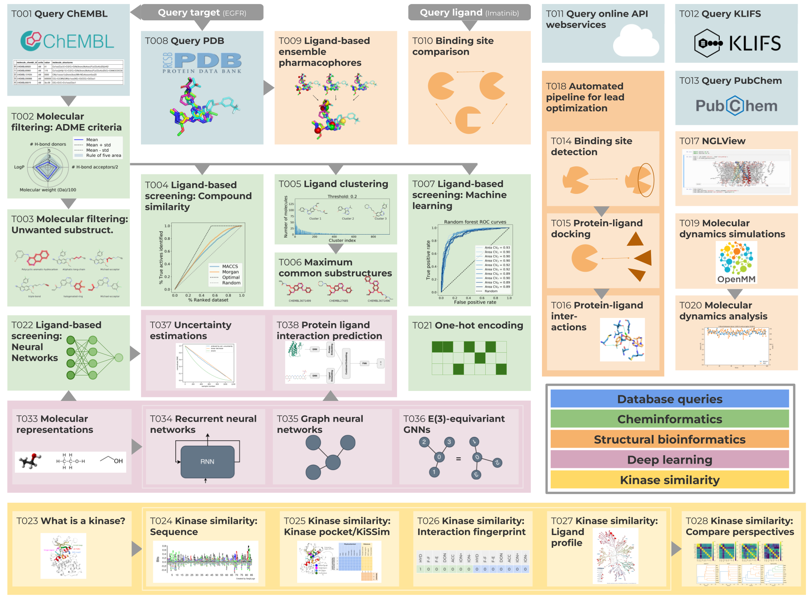

# TeachOpenCADD

A teaching platform for computer-aided drug design (CADD) using open source packages and data.


[](https://doi.org/10.5281/zenodo.1486226)

<!-- markdown-link-check-disable-next-line -->
[](https://creativecommons.org/licenses/by/4.0/)

[](https://github.com/volkamerlab/teachopencadd/actions/workflows/talktorial.yml)

   

> If you use TeachOpenCADD in a publication,
> please [cite](https://projects.volkamerlab.org/teachopencadd/citation.html) us!
> If you use TeachOpenCADD in class, please include a link back to our repository.
<!-- markdown-link-check-disable-next-line -->
> In any case, please [star](https://docs.github.com/en/get-started/exploring-projects-on-github/saving-repositories-with-stars)
> (and tell your students to star) those repositories you consider useful for your learning/teaching activities.

## Description

<p align="center">
  
  <br>
  <font size="1">
  Figure adapted from Figure 1 in the TeachOpenCADD publication
  <a href="https://jcheminf.biomedcentral.com/articles/10.1186/s13321-019-0351-x">
  (D. Sydow <i>et al.</i>, J. Cheminformatics, 2019)</a>.
  </font>
</p>

Open source programming packages for cheminformatics and structural bioinformatics are powerful tools to build modular, reproducible, and reusable pipelines for computer-aided drug design (CADD). While documentation for such tools is available, only few freely accessible examples teach underlying concepts focused on CADD applications, addressing especially users new to the field.

TeachOpenCADD is a teaching platform developed by students for students, which provides teaching material for central CADD topics. Since we cover both the theoretical as well as practical aspect of these topics, the platform addresses students and researchers with a biological/chemical as well as a computational background.

Each topic is covered in an interactive Jupyter Notebook, using open source packages such as the Python packages `rdkit`, `pypdb`, `biopandas`, `nglview`, and `mdanalysis` (find the full list [here](https://projects.volkamerlab.org/teachopencadd/external_dependencies.html)). Topics are continuously expanded and open for contributions from the community. Beyond their teaching purpose, the TeachOpenCADD material can serve as starting point for users’ project-directed modifications and extensions.


**New edition**: we have extended the TeachOpenCADD platform with 6 notebooks introducing deep learning and its application to CADD related topics. 

## Get started


If you can't wait and just want to read through the materials, please go to the read-only version [here](https://projects.volkamerlab.org/teachopencadd/talktorials.html).

You can run the TeachOpenCADD talktorials either in the cloud for an instant start or locally for a full development experience.

### Run Online
The fastest way to explore is via **Google Colab**. No installation is required.
* Navigate to the **Talktorials** list below in [Open in Google Colab](#open-in-google-colab) section.
* Click the notebook URL on the title column to launch the tutorial directly in your browser.

---

### Run Locally
To set up the project on your machine you can use the TeachOpenCADD runner. This takes care of downloading the talktorial and necessary data and setting up a virtual environment for talktorials.

#### Using a virtual environment
Create and activate a virtual environment in a folder of your choice.
```bash
python -m venv .venv
source .venv/bin/activate
```
Now you can install TeachOpenCADD via its pip package.
```bash
pip install teachopencadd
teachopencadd -h
```

To start a notebook, you simply call the runner with the talktorial ID:
```bash
teachopencadd 6  # change the ID to whichever talktorial you are interested in
```

You can also use [uv](https://docs.astral.sh/uv/) to directly run a notebook. There is no need to download the notebook by hand.
```bash
uv run --with teachopencadd teachopencadd -h
```

## Open in Google Colab

| Talktorial | Title                                           |
|     :-:    | :---                                            |
|    T001    | [Compound data acquisition (ChEMBL)][1]  | 
|    T002    | [Molecular filtering: ADME and lead-likeness criteria][2]|
|    T003    | [Molecular filtering: unwanted substructures][3]|
|    T004    | [Ligand-based screening: compound similarity][4]|
|    T005    | [Compound clustering][5]| 
|    T006    | [Maximum common substructure][6]|
|    T007    | [Ligand-based screening: machine learning][7]|
|    T008    | [Protein data acquisition: Protein Data Bank (PDB)][8]|
|    T009    | [Ligand-based pharmacophores][9]|
|    T010    | [Binding site similarity and off-target prediction][10]|
|    T011    | [Querying online API webservices][11]|
|    T012    | [Data acquisition from KLIFS][12]|
|    T013    | [Data acquisition from PubChem][13]|
|    T014    | [Binding site detection][14]|
|    T015    | [Protein ligand docking][15]|
|    T016    | [Protein-ligand interactions][16]|
|    T017    | [Advanced NGLview usage][17]|
|    T018    | [Automated pipeline for lead optimization][18]|
|    T019    | [Molecular dynamics simulation][19]|
|    T020    | [Analyzing molecular dynamics simulations][20]|
|    T021    | [One-Hot Encoding][21]|
|    T022    | [Ligand-based screening: neural networks][22]|
|    T023    | [What is a kinase?][23]|
|    T024    | [Kinase similarity: Sequence][24]|
|    T025    | [Kinase similarity: Kinase pocket (KiSSim fingerprint)][25]|
|    T026    | [Kinase similarity: Interaction fingerprints][26]|
|    T027    | [Kinase similarity: Ligand profile][27]|
|    T028    | [Kinase similarity: Compare different perspectives][28]|
|    T033    | [Molecular representations][33]|
|    T034    | [RNN-based molecular property prediction][34]|
|    T035    | [GNN-based molecular property prediction][35]|
|    T036    | [An introduction to E(3)-invariant graph neural networks][36]|
|    T037    | [Uncertainty estimation][37]|
|    T038    | [Protein Ligand Interaction Prediction][38]|

[1]: https://colab.research.google.com/github/volkamerlab/teachopencadd/blob/dev/teachopencadd/talktorials/T001_query_chembl/talktorial.ipynb
[2]: https://colab.research.google.com/github/volkamerlab/teachopencadd/blob/dev/teachopencadd/talktorials/T002_compound_adme/talktorial.ipynb
[3]: https://colab.research.google.com/github/volkamerlab/teachopencadd/blob/dev/teachopencadd/talktorials/T003_compound_unwanted_substructures/talktorial.ipynb
[4]: https://colab.research.google.com/github/volkamerlab/teachopencadd/blob/dev/teachopencadd/talktorials/T004_compound_similarity/talktorial.ipynb
[5]: https://colab.research.google.com/github/volkamerlab/teachopencadd/blob/dev/teachopencadd/talktorials/T005_compound_clustering/talktorial.ipynb
[6]: https://colab.research.google.com/github/volkamerlab/teachopencadd/blob/dev/teachopencadd/talktorials/T006_compound_maximum_common_substructures/talktorial.ipynb
[7]: https://colab.research.google.com/github/volkamerlab/teachopencadd/blob/dev/teachopencadd/talktorials/T007_compound_activity_machine_learning/talktorial.ipynb
[8]: https://colab.research.google.com/github/volkamerlab/teachopencadd/blob/dev/teachopencadd/talktorials/T008_query_pdb/talktorial.ipynb
[9]: https://colab.research.google.com/github/volkamerlab/teachopencadd/blob/dev/teachopencadd/talktorials/T009_compound_ensemble_pharmacophores/talktorial.ipynb
[10]: https://colab.research.google.com/github/volkamerlab/teachopencadd/blob/dev/teachopencadd/talktorials/T010_binding_site_comparison/talktorial.ipynb
[11]: https://colab.research.google.com/github/volkamerlab/teachopencadd/blob/dev/teachopencadd/talktorials/T011_query_online_api_webservices/talktorial.ipynb
[12]: https://colab.research.google.com/github/volkamerlab/teachopencadd/blob/dev/teachopencadd/talktorials/T012_query_klifs/talktorial.ipynb
[13]: https://colab.research.google.com/github/volkamerlab/teachopencadd/blob/dev/teachopencadd/talktorials/T013_query_pubchem/talktorial.ipynb
[14]: https://colab.research.google.com/github/volkamerlab/teachopencadd/blob/dev/teachopencadd/talktorials/T014_binding_site_detection/talktorial.ipynb
[15]: https://colab.research.google.com/github/volkamerlab/teachopencadd/blob/dev/teachopencadd/talktorials/T015_protein_ligand_docking/talktorial.ipynb
[16]: https://colab.research.google.com/github/volkamerlab/teachopencadd/blob/dev/teachopencadd/talktorials/T016_protein_ligand_interactions/talktorial.ipynb
[17]: https://colab.research.google.com/github/volkamerlab/teachopencadd/blob/dev/teachopencadd/talktorials/T017_advanced_nglview_usage/talktorial.ipynb
[18]: https://colab.research.google.com/github/volkamerlab/teachopencadd/blob/dev/teachopencadd/talktorials/T018_automated_cadd_pipeline/talktorial.ipynb
[19]: https://colab.research.google.com/github/volkamerlab/teachopencadd/blob/dev/teachopencadd/talktorials/T019_md_simulation/talktorial.ipynb
[20]: https://colab.research.google.com/github/volkamerlab/teachopencadd/blob/dev/teachopencadd/talktorials/T020_md_analysis/talktorial.ipynb
[21]: https://colab.research.google.com/github/volkamerlab/teachopencadd/blob/dev/teachopencadd/talktorials/T021_one_hot_encoding/talktorial.ipynb
[22]: https://colab.research.google.com/github/volkamerlab/teachopencadd/blob/dev/teachopencadd/talktorials/T022_ligand_based_screening_neural_network/talktorial.ipynb
[23]: https://colab.research.google.com/github/volkamerlab/teachopencadd/blob/dev/teachopencadd/talktorials/T023_what_is_a_kinase/talktorial.ipynb
[24]: https://colab.research.google.com/github/volkamerlab/teachopencadd/blob/dev/teachopencadd/talktorials/T024_kinase_similarity_sequence/talktorial.ipynb
[25]: https://colab.research.google.com/github/volkamerlab/teachopencadd/blob/dev/teachopencadd/talktorials/T025_kinase_similarity_kissim/talktorial.ipynb
[26]: https://colab.research.google.com/github/volkamerlab/teachopencadd/blob/dev/teachopencadd/talktorials/T026_kinase_similarity_ifp/talktorial.ipynb
[27]: https://colab.research.google.com/github/volkamerlab/teachopencadd/blob/dev/teachopencadd/talktorials/T027_kinase_similarity_ligand_profile/talktorial.ipynb
[28]: https://colab.research.google.com/github/volkamerlab/teachopencadd/blob/dev/teachopencadd/talktorials/T028_kinase_similarity_compare_perspectives/talktorial.ipynb
[33]: https://colab.research.google.com/github/volkamerlab/teachopencadd/blob/dev/teachopencadd/talktorials/T033_molecular_representations/talktorial.ipynb
[34]: https://colab.research.google.com/github/volkamerlab/teachopencadd/blob/dev/teachopencadd/talktorials/T034_recurrent_neural_networks/talktorial.ipynb
[35]: https://colab.research.google.com/github/volkamerlab/teachopencadd/blob/dev/teachopencadd/talktorials/T035_graph_neural_networks/talktorial.ipynb
[36]: https://colab.research.google.com/github/volkamerlab/teachopencadd/blob/dev/teachopencadd/talktorials/T036_e3_equivariant_gnn/talktorial.ipynb
[37]: https://colab.research.google.com/github/volkamerlab/teachopencadd/blob/dev/teachopencadd/talktorials/T037_uncertainty_estimation/talktorial.ipynb
[38]: https://colab.research.google.com/github/volkamerlab/teachopencadd/blob/dev/teachopencadd/talktorials/T038_protein_ligand_interaction_prediction/talktorial.ipynb

## TeachOpenCADD KNIME workflows

<!-- markdown-link-check-disable-next-line -->
[](https://pubs.acs.org/doi/10.1021/acs.jcim.9b00662)
[](https://doi.org/10.5281/zenodo.3626897)
[](https://hub.knime.com/-/spaces/-/~xYhrR1mfFcGNxz7I/current-state/)

If you prefer to work in the context of a graphical interface, talktorials T001-T008 are also available as [KNIME workflows](https://hub.knime.com/-/spaces/-/~xYhrR1mfFcGNxz7I/current-state/). Questions regarding this version should be addressed using the "Discussion section" available at [this post](https://forum.knime.com/t/teachopencadd-knime/17174). You need to create a KNIME account to use the forum.

## About TeachOpenCADD

- [Contact](https://projects.volkamerlab.org/teachopencadd/contact.html)
- [Acknowledgments](https://projects.volkamerlab.org/teachopencadd/acknowledgments.html)
- [Citation](https://projects.volkamerlab.org/teachopencadd/citation.html)
- [License](https://projects.volkamerlab.org/teachopencadd/license.html)
- [Funding](https://projects.volkamerlab.org/teachopencadd/funding.html)


## External resources

Please refer to our TeachOpenCADD website to find a list of external resources:
- [External packages and webservices](https://projects.volkamerlab.org/teachopencadd/external_dependencies.html) that are used in the TeachOpenCADD material
- [Further reading material](https://projects.volkamerlab.org/teachopencadd/external_tutorials_collections.html) on Python programming, cheminformatics, structural bioinformatics, and more.
