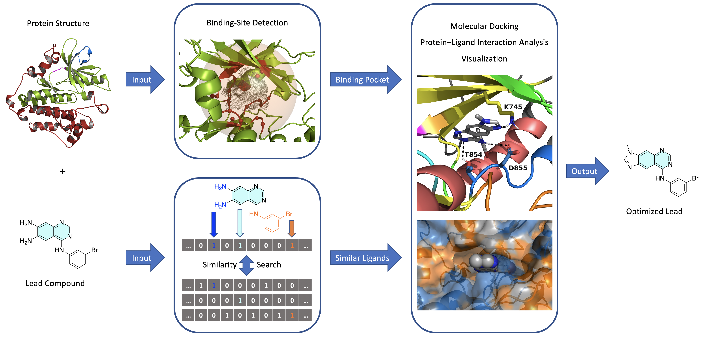

# T018 - Fully Automated Drug Design Pipeline

__Authors__
* Armin Ariamajd, Charité/Freie Universität Berlin
* Melanie Vogel,  Charité/Freie Universität Berlin
* Corey Taylor,  Charité

## Aim of This Talktorial

In this talktorial we will learn how to develop an **automated structure-based virtual screening pipeline**. This is particulary suited for the hit expansion and lead optimization phases of a drug discovery project, where a promising ligand (i.e. an initial hit or lead compound) needs to be structurally modified in order to improve its binding affinity and selectivity for the target protein. The general architecture of the pipeline can thus be summarized as follows (Figure 1):

**Input**
* A target protein structure and a promising ligand plus specifications of the processes that need to be performed.

**Processes**
1. Detection of the most druggable binding site for the given protein structure.
2. Finding derivatives and structural analogs for the ligand. 
3. Performing docking calculations on the selected binding site of those analogs.
4. Analyzing and vizualizing predicted protein–ligand interactions and binding modes for each analog.

**Output**
* Protein-ligand structure(s) optimized for affinity and selectivity.

**Figure 1.** General architecture of the automated structure-based virtual screening pipeline.

 

### Contents in *Theory*

1. Drug Design Pipeline
1. Binding Site Detection 
2. Chemical Similarity
3. Molecular Docking
4. Protein-Ligand Interactions
5. Visual Inspection of The Docking Results

### Contents in *Practical*

1. Outline of The Virtual Screening Pipeline
2. Reading The Input Data and Initializing Output Paths
3. Processing The Input Protein Data
4. Processing the Input Ligand Data
5. Binding Site Detection
6. Ligand Similarity-Search 
7. Molecular Docking
8. Analysis of Protein–Ligand Interactions
9. Selection of Best Optimized Ligand
10. Putting The Pieces Together: A Fully Automated Pipeline

### References
* Journal article on *TeachOpenCADD* teaching platform for computer-aided drug design: [D. Sydow <i>et al.</i>, <i>J. Cheminform.</i> <b>2019</b>, 11, 29.](https://doi.org/10.1186/s13321-019-0351-x)
* [*TeachOpenCADD* website](https://projects.volkamerlab.org/teachopencadd/index.html) at [Volkamer lab](https://volkamerlab.org/)
* This talktorial is inspired by the *TeachOpenCADD* Talktorials [T013 - T017](https://github.com/volkamerlab/teachopencadd/tree/t011-base/teachopencadd/talktorials)

#### Drug Design Pipeline
* Book on drug design: [G. Klebe, <i>Drug Design</i>, Springer, <b>2013</b>.](https://doi.org/10.1007/978-3-642-17907-5)
* Review article on early stages of drug discovery: [Hughes <i>et al.</i>, Br. J. Pharmacol.</i> <b>2011</b>, 162, 1239-1249.](https://doi.org/10.1111/j.1476-5381.2010.01127.x)
* Review article on computational drug design: [Sliwoski <i>et al.</i>, <i>Pharmacol. Rev.</i> <b>2014</b>, 66, 334-395.](https://doi.org/10.1124/pr.112.007336)
* Review article on computational drug discovery: [Leelananda <i>et al.</i>, <i>Beilstein J. Org. Chem.</i> <b>2016</b>, 12, 2694-2718.](https://doi.org/10.3762/bjoc.12.267)
* Review article on free software for building a virtual screening pipeline: [Glaab, <i>Brief. Bioinform.</i> <b>2016</b>, 17, 352-366.](https://doi.org/10.1093/bib/bbv037)
* Review article on automating drug discovery: [Schneider, <i>Nat. Rev. Drug Discov.</i> <b>2018</b>, 17, 97-113.](https://doi.org/10.1038/nrd.2017.232)
* Review article on structure-based drug discovery: [Batool <i>et al.</i>, <i>Int. J. Mol. Sci.</i> <b>2019</b>, 20, 2783.](https://doi.org/10.3390/ijms20112783)

#### Binding-Site Detection and The *DoGSiteScorer* Program 
* Book chapter on prediction and analysis of binding sites: [Volkamer <i>et al.</i>, <i>Applied Chemoinformatics</i>, Wiley, <b>2018</b>, pp. 283-311.](https://doi.org/10.1002/9783527806539.ch6g)
* Journal article on binding-site and druggability predictions using *DoGSiteScorer*: [Volkamer <i>et al.</i>, <i>J. Chem. Inf. Model.</i> <b>2012</b>, <i>52</i>, 360-372.](https://doi.org/10.1021/ci200454v)
* Journal article describing the *ProteinsPlus* web-portal: [R. Fahrrolfes <i>et al.</i>, <i>Nucleic Acids Res.</i> <b>2017</b>, 45, W337-W343.](https://doi.org/10.1093/nar/gkx333)
* [*ProteinsPlus* website](https://proteins.plus/), and information regarding the usage of its *DoGSiteScorer* [REST-API](https://proteins.plus/help/dogsite_rest)
* *TeachOpenCADD* Talktorial on binding-site detection: [Talktorial T014](https://github.com/volkamerlab/teachopencadd/tree/t011-base/teachopencadd/talktorials/T014_binding_site_detection)
* *TeachOpenCADD* talktorial on querying online API web-services: [Talktorial T011](https://github.com/volkamerlab/teachopencadd/tree/t011-base/teachopencadd/talktorials/T011_query_online_api_webservices)

#### Chemical Similarity and The *PubChem* Online Database
* Review article on molecular similarity in medicinal chemistry: [G. Maggiora <i>et al.</i>, <i>J. Med. Chem.</i> <b>2014</b>, 57, 3186-3204.](https://doi.org/10.1021/jm401411z)
* Journal article on extended-connectivity fingerprints: [D. Rogers <i>et al.</i>, <i>J. Chem. Inf. Model.</i> <b>2010</b>, 50, 742-754.](https://doi.org/10.1021/ci100050t)
* Journal article describing the latest developments of the *PubChem* web-services: [S. Kim <i>et al.</i>, <i>Nucleic Acids Res.</i> <b>2019</b>, 47, D1102-D1109.](https://doi.org/10.1093/nar/gky1033)
* [*PubChem* website](https://pubchem.ncbi.nlm.nih.gov/), and information regarding the usage of its [APIs](https://pubchemdocs.ncbi.nlm.nih.gov/programmatic-access)
* Description of *PubChem*'s [custom substructure fingerprint](https://ftp.ncbi.nlm.nih.gov/pubchem/specifications/pubchem_fingerprints.pdf) and [*Tanimoto* similarity measure](https://jcheminf.biomedcentral.com/articles/10.1186/s13321-016-0163-1) used in its similarity search engine.  
* *TeachOpenCADD* talktorial on compound similarity: [Talktorial T004](https://github.com/volkamerlab/teachopencadd/blob/master/teachopencadd/talktorials/T004_compound_similarity/talktorial.ipynb)
* *TeachOpenCADD* talktorial on data acquisition from PubChem: [Talktorial T013](https://github.com/volkamerlab/teachopencadd/blob/t011-base/teachopencadd/talktorials/T013_query_pubchem/talktorial.ipynb) 

#### Molecular Docking and The *Smina* Program
* Review article on molecular docking algorithms: [X. Y. Meng <i>et al.</i>, <i>Curr. Comput. Aided Drug Des.</i> <b>2011</b>, 7, 146-157.](https://doi.org/10.2174/157340911795677602)
* Review article on different software used for molecular docking: [N. S. Pagadala <i>et al.</i>, <i>Biophys. Rev.</i> <b>2017</b>, 9, 91-102.](https://doi.org/10.1007/s12551-016-0247-1)
* Review article on evaluation and comparison of different docking algorithms: [G. L. Warren <i> et al.</i>, <i>J. Med. Chem.</i> <b>2006</b>, 49, 5912-5931.](https://doi.org/10.1021/jm050362n)
* Review article on evaluation of ten docking programs on a diverse set of protein-ligand complexes: [Z. Wang <i> et al.</i>, Phys. Chem. Chem. Phys.</i> <b>2016</b>, 18, 12964-12975.](https://doi.org/10.1039/C6CP01555G)
* Journal article describing the Smina docking program and its scoring function: [D. R. Koes <i>et al.</i>, <i>J. Chem. Inf. Model.</i> <b>2013</b>, 53, 1893-1904.](https://doi.org/10.1021/ci300604z) 
* [*OpenBabel* documentation](http://openbabel.org/wiki/Main_Page)
* [*Smina* documentation](https://sourceforge.net/projects/smina/)
* *TeachOpenCADD* talktorial on protein–ligand docking: [Talktorial T015](https://github.com/volkamerlab/teachopencadd/blob/t011-base/teachopencadd/talktorials/T015_protein_ligand_docking/talktorial.ipynb)

#### Protein-Ligand Interactions and the *PLIP* Program
* Review article on protein-ligand interactions: [X. Du <i>et al.</i>, <i>Int. J. Mol. Sci.</i> <b>2016</b>, 17, 144.](https://doi.org/10.3390/ijms17020144)
* Journal article analyzing the types and frequencies of different protein-ligand interactions in available protein-ligand complex structures: [R. Ferreira de Freitas <i> et al.</i>, <i>Med. Chem. Commun.</i> <b>2017</b>, 8, 1970-1981.](https://doi.org/10.1039/C7MD00381A)
* Journal article describing the *PLIP* algorithm: [S. Salentin <i>et al.</i>, <i>Nucleic Acids Res.</i> <b>2015</b>, 43, W443-447.](https://doi.org/10.1093/nar/gkv315)
* [*PLIP* website](https://plip-tool.biotec.tu-dresden.de/plip-web/plip/index)
* [*PLIP* documentation](https://github.com/pharmai/plip)
* *TeachOpenCADD* talktorial on protein-ligand interactions: [Talktorial T016](https://github.com/volkamerlab/teachopencadd/blob/t011-base/teachopencadd/talktorials/T016_protein_ligand_interactions/talktorial.ipynb)

#### Visual Inspection of Docking Results and NGLView
* Journal article describing the NGLView program: [H. Nguyen <i>et al.</i>, <i>Bioinformatics</i> <b>2018</b>, 34, 1241-1242.](https://doi.org/10.1093/bioinformatics/btx789)
* [*NGLView* documentation](http://nglviewer.org/nglview/latest/api.html)
* *TeachOpenCADD* talktorial on advanced NGLView usage: [Talktorial T017](https://github.com/volkamerlab/teachopencadd/blob/t011-base/teachopencadd/talktorials/T017_advanced_nglview_usage/talktorial.ipynb)

